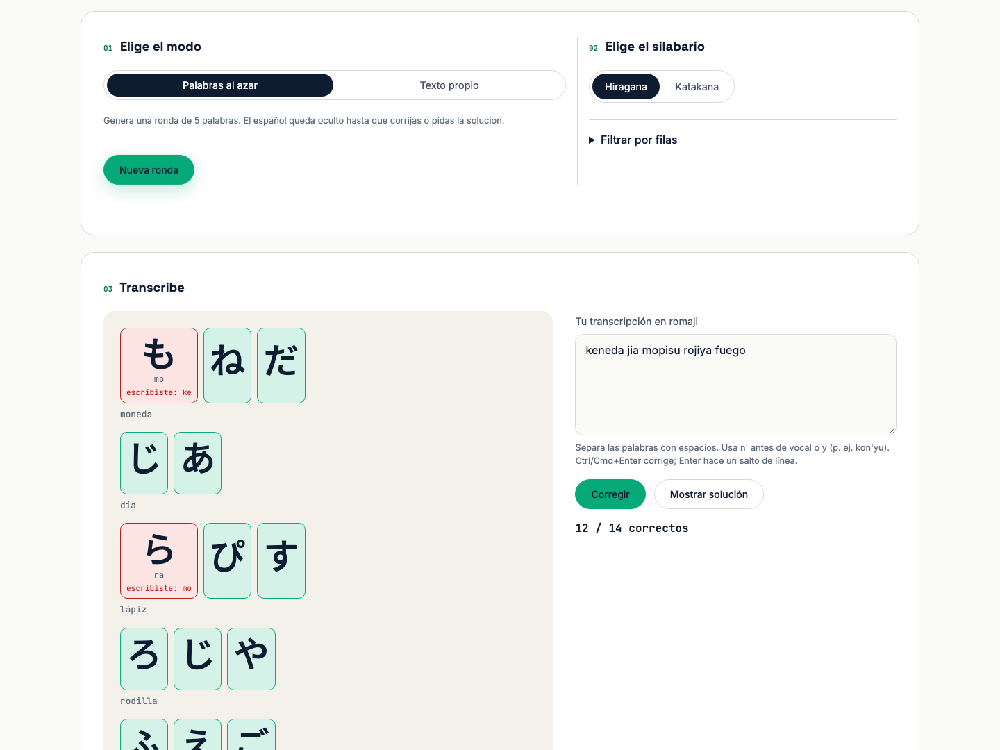
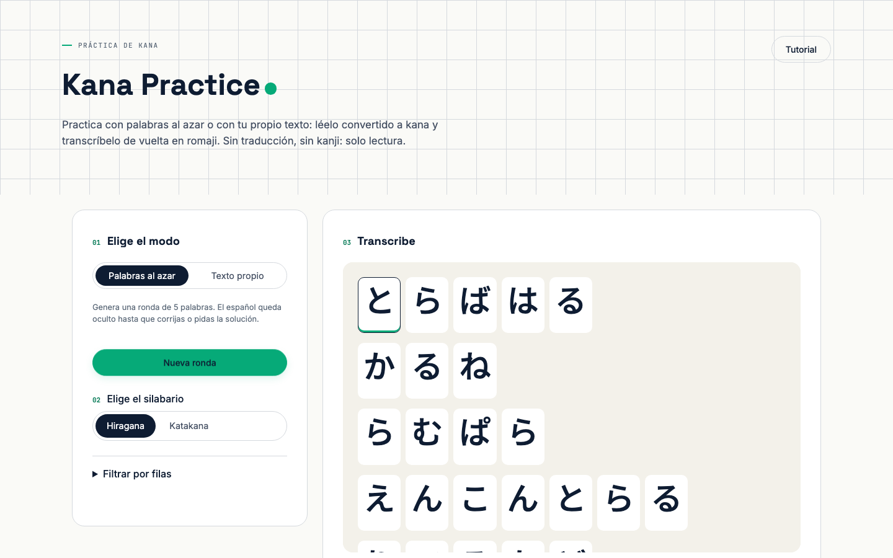
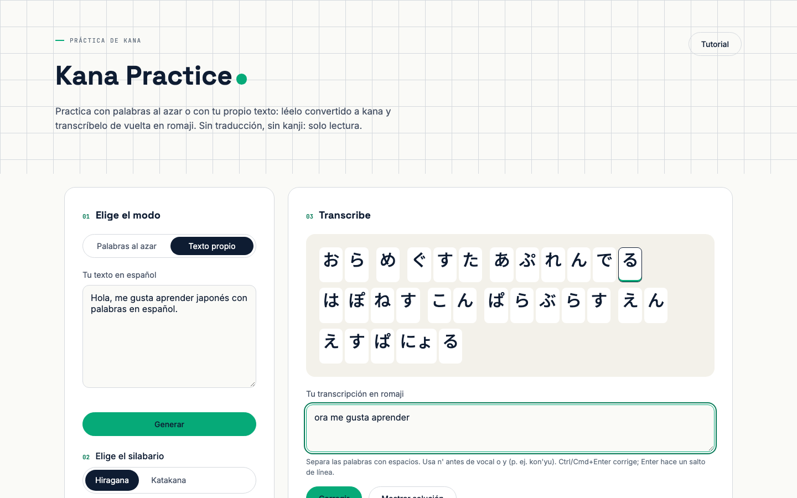
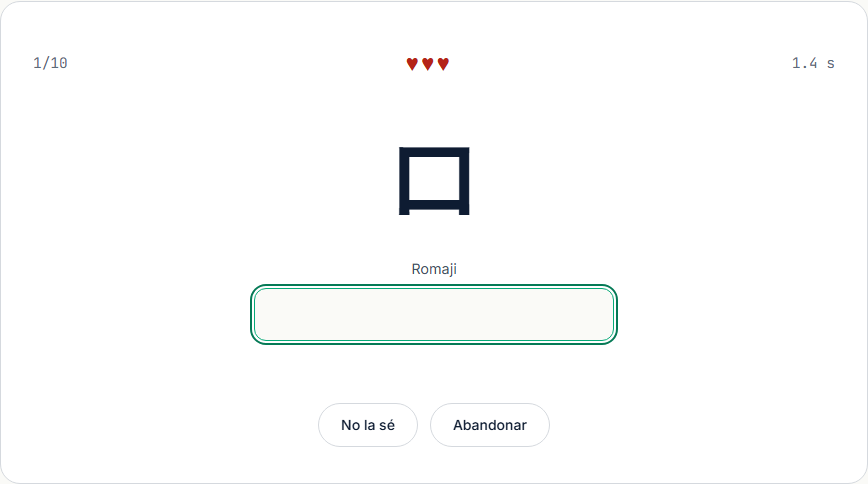
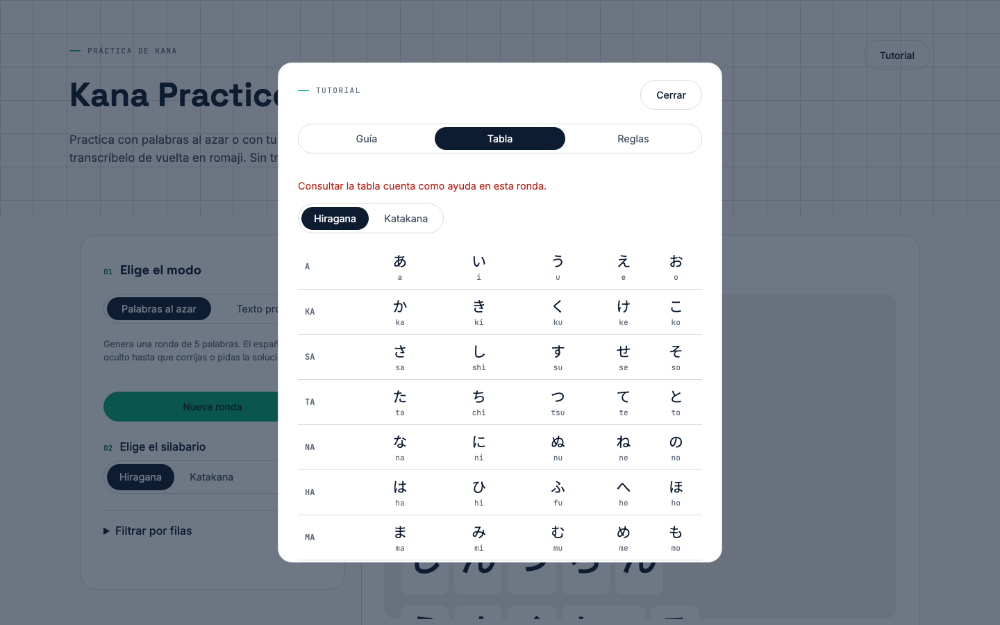
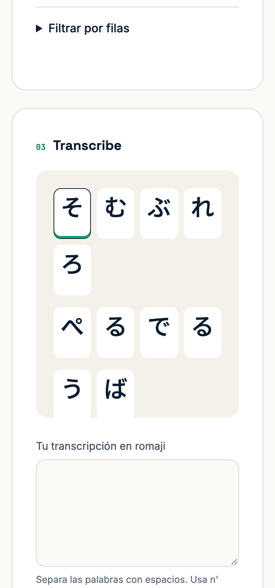
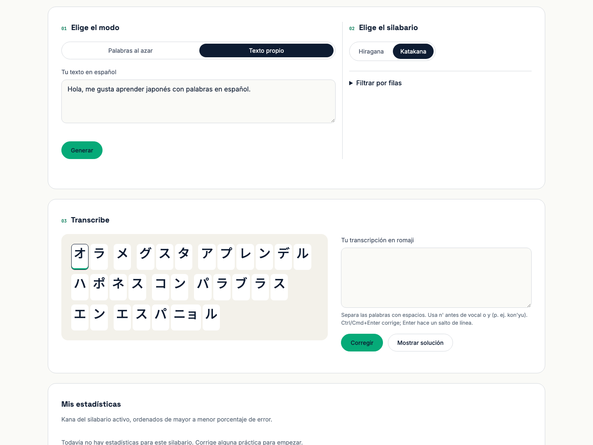
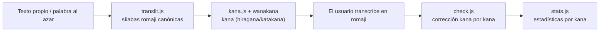

# Kana Practice

Web estática para practicar la lectura de kana (hiragana y katakana), adaptando texto en
español al japonés fonéticamente.

**Pruébala:** https://kana-practice-green.vercel.app

[](LICENSE)
[](https://kana-practice-green.vercel.app)
[](tests/e2e)
[](vendor/wanakana-5.3.1.js)



## ¿Qué hace?

- Convierte una palabra al azar o un texto propio en español a kana (hiragana o katakana),
  siguiendo reglas fonéticas fijas: es una adaptación de sonido, no una traducción.
- Escondes el español y transcribes el kana de vuelta a romaji; la app corrige kana por kana
  y marca cada unidad en verde (correcta) o rojo (incorrecta).
- Acepta las variantes romaji habituales (shi/si, tsu/tu, fu/hu, ji/zi, n/nn) para no penalizar
  estilos de romanización distintos.
- Lleva estadísticas de acierto por kana en el navegador, para detectar qué sílabas cuestan más.

## Cómo se usa

1. Elige el modo: **Palabras al azar** genera una ronda de 5 palabras con un clic; **Texto
   propio** convierte cualquier párrafo que escribas o pegues.
2. Elige el silabario (hiragana o katakana) y, si quieres, filtra qué filas del silabario
   entran en práctica.
3. Lee el kana generado y escribe la transcripción en romaji en el cuadro de respuesta.
4. Pulsa **Corregir** (o Ctrl/Cmd+Enter) para ver el resultado kana por kana, o **Mostrar
   solución** para revelar la respuesta completa sin que cuente en las estadísticas.

En pantallas de escritorio, la barra superior agrupa el modo (01) y el silabario (02) en
horizontal, y debajo la sección **Transcribe** (03) muestra el kana a la izquierda y tu
respuesta a la derecha, lado a lado. En pantallas angostas, estos bloques se apilan uno debajo
del otro.

<table>
<tr>
<th>Palabras al azar</th>
<th>Texto propio</th>
</tr>
<tr>
<td></td>
<td></td>
</tr>
</table>

## Tarjetas: para quien empieza

La página [**Tarjetas**](https://kana-practice-green.vercel.app/tarjetas.html) es un minijuego para
aprender los kana sueltos, antes de leer palabras:

- Sale un kana al azar y escribes su lectura en romaji; si es correcta, pasa sola a la siguiente.
- Eliges el silabario (hiragana, katakana o ambos), el mazo (46 básicos o los 102 con dakuten y
  combinados como きゃ) y el tamaño de la ronda (5, 10, 20 o el mazo completo).
- Tienes 3 vidas por ronda: cada error o «No la sé» resta una y muestra la lectura correcta.
- Se mide el tiempo de cada tarjeta; al final ves tu media por acierto, las tarjetas más lentas,
  tus errores y tu récord para esa configuración. Los aciertos y errores también suman a «Mis
  estadísticas».



## De español a kana

La app no traduce: reescribe cada palabra en español como una secuencia de sílabas romaji
canónicas (reglas fijas como c/qu→k, g/j→h, ll→y, ñ→ny) y esas sílabas se convierten a kana con
[wanakana](https://github.com/WaniKani/WanaKana). El resultado suena parecido en japonés, no
significa lo mismo.

| Español | Kana | Romaji |
|---|---|---|
| casa | かさ | ka-sa |
| tres | とれす | to-re-su |
| hola | おら | o-ra |
| luna | るな | ru-na |
| jugo | ふご | fu-go |
| canción | かんしおん | ka-n-shi-o-n |

El tutorial de la app (pestaña **Reglas**) documenta cada regla con ejemplos calculados en
vivo por el mismo código, para que nunca queden desincronizados.

## Funciones

- **Variantes aceptadas al corregir:** shi/si, chi/ti, tsu/tu, fu/hu, ji/zi, sha/sya, n/nn, y
  `n'` antes de vocal o "y" (por ejemplo, `kon'yu`).
- **Estadísticas por kana:** cada silabario guarda su propio historial de aciertos/errores en
  `localStorage`, ordenado de mayor a menor porcentaje de error.
- **Filtro por filas:** puedes limitar la práctica a filas concretas del silabario (por
  ejemplo, solo あ/か/さ mientras aprendes las primeras).
- **Tutorial integrado:** guía rápida, tabla completa de kana (con conmutador
  hiragana/katakana) y las reglas de adaptación con ejemplos. Se abre solo en la primera
  visita y siempre se puede reabrir con el botón de la cabecera.
- **Responsive:** la interfaz se adapta a pantallas de escritorio y móviles.

<table>
<tr>
<th>Tutorial (pestaña Tabla)</th>
<th>Móvil</th>
</tr>
<tr>
<td></td>
<td></td>
</tr>
</table>

Katakana funciona igual que hiragana, con el mismo texto o la misma ronda:



## Flujo de datos



## Ejecutar en local

No hace falta instalar nada, es un sitio estático. Basta con servir la carpeta:

```bash
python3 -m http.server 8765
```

Y abrir `http://localhost:8765` en el navegador.

## Pruebas E2E

Las pruebas viven en `tests/e2e/` y usan Playwright:

```bash
npm install
npx playwright install chromium
npx playwright test
```

El reporte HTML generado (`playwright-report/index.html`) es el artefacto verificable de cada
corrida.

Para correr la misma suite contra producción:

```bash
BASE_URL=https://kana-practice-green.vercel.app npx playwright test
```

## Stack

- HTML + CSS + JavaScript con módulos ES, sin framework ni paso de build.
- [wanakana](https://github.com/WaniKani/WanaKana) 5.3.1, vendorizada en
  `vendor/wanakana-5.3.1.js` (única dependencia de runtime).
- [Playwright](https://playwright.dev/) para las pruebas E2E.
- Deploy en [Vercel](https://vercel.com/), automático desde `main`.

## Estructura del proyecto

```
index.html          Marcado y estructura de la página
tarjetas.html       Minijuego de tarjetas
style.css            Estilos
src/
  app.js             Conecta la UI con el resto de módulos
  cards.js           UI del minijuego de tarjetas
  translit.js         Español -> sílabas romaji canónicas
  kana.js             Sílabas romaji -> unidades de kana (usa wanakana)
  check.js            Corrección kana por kana
  stats.js            Estadísticas por kana (localStorage)
  words.js            Banco de palabras para el modo al azar
vendor/
  wanakana-5.3.1.js    Dependencia vendorizada
tests/e2e/           Suite Playwright
docs/screenshots/    Capturas usadas en este README
scripts/             Generador de favicons y og.png (npm run assets)
```

## Licencia

MIT, ver [LICENSE](LICENSE). Incluye wanakana 5.3.1 (MIT) en `vendor/`.
